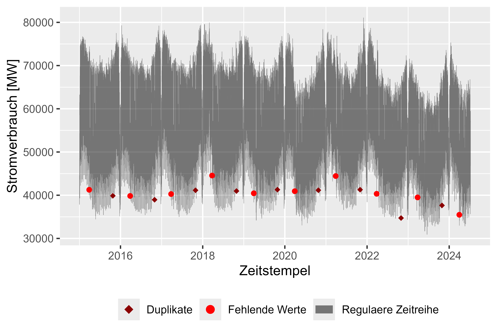
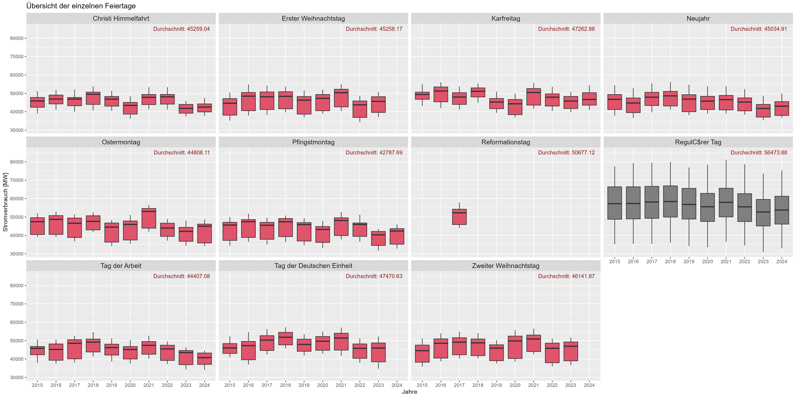
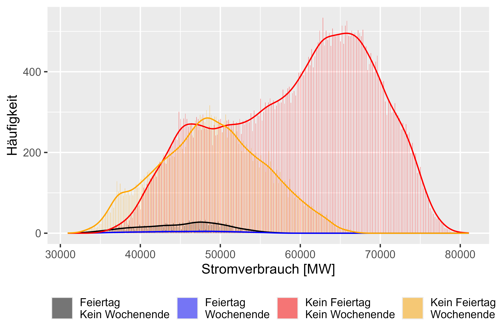
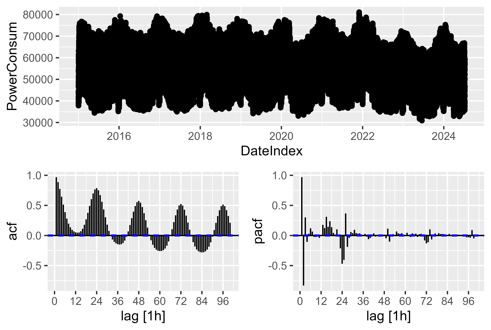

# smard-power-forecasting

This repository is for forecasting german energy power consumption.

Based opn and inspired from:

- [Forecasting: Principles and Practice](https://otexts.com/fpp3/)
- DOI: [10.1109/TPWRS.2011.2162082](https://ieeexplore.ieee.org/document/5985500) - Short-Term Load Forecasting Based on a Semi-Parametric Additive Model
- DOI: [10.1109/TPWRS.2009.2036017](https://ieeexplore.ieee.org/document/5345698) - Density Forecasting for Long-Term Peak Electricity Demand
- DOI: [10.1080/00031305.2017.1380080](https://www.tandfonline.com/doi/full/10.1080/00031305.2017.1380080) - Forecasting at Scale

Data source: [SMARD](https://www.smard.de/home/downloadcenter/download-marktdaten/)
    
- Resolution: 1h
- Timewindow: from 2015-01-01 to 2024-09-07

Put all dowloaded files into:

    /example/dataset # there is already use dataset included

Check the [forecast.Rmd](example/forecast.Rmd) file to see how you can run
this code on a updated Version of SMARD-Data.

---

# Features and Raw Dataset

## Load data with generated features
Try to work in example/ folder for beginning.

    # Define datapaths
    power_consum_path <- "dataset\\stunde_2015_2024\\Realisierter_Stromverbrauch_201501010000_202407090000_Stunde.csv"
    power_consum_smard_prediction_path <- "dataset\\propgnose_vom_smard\\Prognostizierter_Stromverbrauch_202401010000_202407090000_Stunde.csv"
    
    # Load Smard Prediction
    power_consum_smard_prediction_loaded <- load_power_consum(path=power_consum_smard_prediction_path)
    raw_smard_pred <- power_consum_smard_prediction_loaded$raw_data
    cleaned_smard_pred <- power_consum_smard_prediction_loaded$cleaned_data
    
    cleaned_smard_pred <- cleaned_smard_pred |>
      mutate(.model = "SMARD")
    names(cleaned_smard_pred)[names(cleaned_smard_pred) == "PowerConsum"] <- ".mean"
    
    # Load PowerConsum Data
    power_consum_loaded <- load_power_consum(path=power_consum_path)
    raw_power_consum <- power_consum_loaded$raw_data
    cleaned_power_consum <- power_consum_loaded$cleaned_data
    
    # Generate more features
    cleaned_power_consum$localName[is.na(cleaned_power_consum$localName)] = "Working-Day"
    cleaned_power_consum$MeanLastWeek <- rollapply(cleaned_power_consum$PowerConsum, width = 24*8, FUN = function(x) mean(x[1:(24*8-25)]), align = "right", fill = NA)
    cleaned_power_consum$MeanLastTwoDays <- rollapply(cleaned_power_consum$PowerConsum, width = 24*3, FUN = function(x) mean(x[1:(24*3-25)]), align = "right", fill = NA)
    cleaned_power_consum$MaxLastOneDay <- rollapply(cleaned_power_consum$PowerConsum, width = 24*2, FUN = function(x) max(x[1:(24*2-25)]), align = "right", fill = NA)
    cleaned_power_consum$MinLastOneDay <- rollapply(cleaned_power_consum$PowerConsum, width = 24*2, FUN = function(x) min(x[1:(24*2-25)]), align = "right", fill = NA) 

Following features were generated from the dataset and the Holiday API:

| Index | Column Name                           | Description                                                      |
|-------|---------------------------------------|------------------------------------------------------------------|
| 1     | DateFrom                              | For validation of DateIndex (similar, but raw)                   |
| 2     | PowerConsum                           | Power Consum in MW                                               |
| 3     | DateIndex                             | Timestamp (yyyy-mm-dd hh:mm:ss)                                  |
| 4     | Weekday                               | Mo, Di, Mi, Do, Fr, Sa, So (Weekdays in german)                  |
| 5     | Date                                  | Date (yyyy-mm-dd)                                                |
| 6     | Year                                  | Year yyyy                                                        |
| 7     | Week                                  | Weeknumber 0-53                                                  |
| 8     | Hour                                  | Hournumber 0-24                                                  |
| 9     | Month                                 | Monthnumber 1-12                                                 |
| 10    | localName                             | Name of a Holiday for Timestamp                                  |
| 11    | WorkDay                               | 1/0 If Workday (Werktag) then 1                                  |
| 12    | Mo                                    | 1/0 If Monday then 1                                             |
| 13    | Di                                    | 1/0 If Tuesday then 1                                            |
| 14    | Mi                                    | 1/0 If Wednesday then 1                                          |
| 15    | Do                                    | 1/0 If Thursday then 1                                           |
| 16    | Fr                                    | 1/0 If Friday then 1                                             |
| 17    | Sa                                    | 1/0 If Saturday then 1                                           |
| 18    | So                                    | 1/0 If Sunday then 1 (not needed, if Mon.-Sat. are used)         |
| 19    | Holiday                               | 1/0 If it is a Holiday then 1                                    |
| 20    | WorkdayHolidayWeekend                 | If it is a Holiday, Weekend or a Workday (for Plots, is Char.)   |
| 21    | HolidayAndWorkDay                     | 1/0 If the Holiday is on a Workday then 1                        |
| 22    | LastDayWasNotWorkDay                  | 1/0 If last day was not a Workday then 1                         |
| 23    | LastDayWasNotWorkDayAndNowWorkDay     | 1/0 If last day was not a Workday and now it is a Workday then 1 |
| 24    | NextDayIsNotWorkDayAndNowWorkDay      | 1/0 If next day is not a Workday and now a workday then 1        |
| 25    | LastDayWasHolidayAndNotWeekend        | 1/0 If last day was a holiday and not a weekend then 1           |
| 26    | NextDayIsHolidayAndNotWeekend         | 1/0 If next day is a holiday and not a weekend then 1            |
| 27    | HolidayName                           | similar to localName (Name of the holiday)                       |
| 28    | EndOfTheYear                          | 1/0 If it the end of the year (Week 52 or 53)                    |
| 29    | FirstWeekOfTheYear                    | 1/0 If it is the beginning of the year (Week 1)                  |
| 30    | HolidayExtended                       | 1/0 Lagged Holiday (6 Hours into the next day)                   |
| 31    | HolidaySmoothed                       | HolidayExtend + sin(2*pi(Hour)+1)/24)                            |
| 32    | MeanLastWeek                          | Mean PowerConsum of the Last Week  (Shift: 24*8-25)              |
| 33    | MeanLastTwoDays                       | Mean PowerConsum of the last two days (Shift: 24*3-25)           |
| 34    | MaxLastOneDay                         | Max PowerConsum of the last Day (Shift: 24*2-25)                 |
| 35    | MinLastOneDay                         | Min PowerConsum of the last Day (Shift: 24*2-25)                 |

 
In this study there is a dataset for Power-Consum in germany from [SMARD](https://www.smard.de/home/downloadcenter/download-marktdaten/) for
the years 2015 - 2024.

Figure 1 shows the raw dataset with missing values (red), duplicated timestamps (darkred) and
Power-Consum over time (grey), hourly resolution. With one missing values and one duplicate every year it was
easy to clean up the dataset. Overall an almost clean set. After cleaning up the dataset there are
plausible observations for the Power-Consum:

- 8760 Observations for a regular year (24*365)
- 8784 Observations for a leap year (24*366)
- Remainded 4559 observations for the last year (2024), year is not complet

There is a simple approach to fill the gaps via taking the last observation (possible, because the resolution is
big enough and because there are only few missing values.). The first value was kept for duplicates.

Figure 1 Raw Power-Consum

# Features Analysis

    local_name_colors <- c(
      "Christi Himmelfahrt" = palette()[2],
      "Erster Weihnachtstag" = palette()[2],
      "Karfreitag" = palette()[2],
      "Neujahr" = palette()[2],
      "Ostermontag" = palette()[2],
      "Pfingstmontag" = palette()[2],
      "Reformationstag" = palette()[2],
      "Tag der Arbeit" = palette()[2],
      "Tag der Deutschen Einheit" = palette()[2],
      "Zweiter Weihnachtstag" = palette()[2],
      "Regulärer Tag" = palette()[1]
    )
    
    
    week_colors <- c(
      "Mo" = palette()[1],
      "Di" = palette()[1],
      "Mi" = palette()[1],
      "Do" = palette()[1],
      "Fr" = palette()[1],
      "Sa" = palette()[2],
      "So" = palette()[2]
    )
    
    working_colors <- c("1" = "#2E9FDF", "0" = "#FC4E07")
    
    whw_colors <- c(
      "Feiertag\nKein Wochenende" = "black",
      "Kein Feiertag\nKein Wochenende" = "red",
      "Kein Feiertag\nWochenende" = "orange",
      "Feiertag\nWochenende" = "blue"
    )
    
    p <- cleaned_power_consum |>
        gg_tsdisplay(PowerConsum, plot_type = "partial", lag = 100)
    
    ggsave(
      "plots/power_consum_acf_pacf.png",
      plot = p,
      width = 5.5,
      height = 3.7,
      dpi = 600
    )
    
    plot_calculated_features(
      cleaned_power_consum = cleaned_power_consum,
      file_name = "plots/MinLastOneDay.png", 
      x = "MinLastOneDay", 
      y = "PowerConsum", 
      x_label = "Minimaler Stromverbrauch vom letzten Tag [MW]",
      y_label = "Stromverbrauch [MW]"
    )
    
    plot_calculated_features(
      cleaned_power_consum = cleaned_power_consum,
      file_name = "plots/MaxLastOneDay.png", 
      x = "MaxLastOneDay", 
      y = "PowerConsum", 
      x_label = "Maximaler Stromverbrauch vom letzten Tag [MW]",
      y_label = "Stromverbrauch [MW]"
    )
    
    plot_calculated_features(
      cleaned_power_consum = cleaned_power_consum,
      file_name = "plots/MeanLastWeek.png", 
      x = "MeanLastWeek", 
      y = "PowerConsum", 
      x_label = "Durchschnittlicher Stromverbrauch der letzten 7 Tage [MW]",
      y_label = "Stromverbrauch [MW]"
    )
    
    
    plot_calculated_features(
      cleaned_power_consum = cleaned_power_consum,
      file_name = "plots/MeanLastTwoDays.png", 
      x = "MeanLastTwoDays", 
      y = "PowerConsum", 
      x_label = "Durchschnittlicher Stromverbrauch der letzten 2 Tage [MW]",
      y_label = "Stromverbrauch [MW]"
    )
    
    plot_histogram_by_group(
      cleaned_power_consum,
      group_name = "WorkdayHolidayWeekend",
      file_name = "plots\\workday_holiday_weekend_histogram.png",
      colors = whw_colors,
      x="PowerConsum",
      x_label = "Stromverbrauch [MW]",
      y_label = "Häufigkeit",
      name_0 = "Wochenende oder Feiertage",
      name_1 = "Werktag"
    )
    
    
    plot_histogram_by_group(
      cleaned_power_consum,
      group_name = "WorkDay",
      file_name = "plots\\workday_histogram.png",
      colors = working_colors,
      x="PowerConsum",
      x_label = "Stromverbrauch [MW]",
      y_label = "Häufigkeit",
      name_0 = "Wochenende oder Feiertage",
      name_1 = "Werktag"
    )
    
    plot_histogram_by_group(
      cleaned_power_consum,
      group_name = "Holiday",
      file_name = "plots\\holiday_histogram.png",
      colors = working_colors,
      x="PowerConsum",
      x_label = "Stromverbrauch [MW]",
      y_label = "Häufigkeit",
      name_0 = "Werktag oder Wochenende",
      name_1 = "Feiertag"
    )
    
    plot_histogram_by_group(
      cleaned_power_consum,
      group_name = "HolidayAndWorkDay",
      file_name = "plots\\holiday_workday_histogram.png",
      colors = working_colors,
      x="PowerConsum",
      x_label = "Stromverbrauch [MW]",
      y_label = "Häufigkeit",
      name_0 = "Wochenende oder Werktag",
      name_1 = "Feiertag am Werktag"
    )
    
    plot_by_group(
      cleaned_power_consum,
      group_name = "HolidayName",
      file_name = "plots\\holiday_boxplot.png",
      colors = local_name_colors,
      title = "Übersicht der einzelnen Feiertage",
      y="PowerConsum",
      y_label="Stromverbrauch [MW]",
      x_label="Jahre"
    )
    
    plot_by_group(
      cleaned_power_consum,
      group_name = "Weekday",
      file_name = "plots\\weekday_boxplot.png",
      colors = week_colors,
      title = "Übersicht der einzelnen Wochentage",
      y = "PowerConsum",
      y_label="Stromverbrauch [MW]",
      x_label="Jahre"
    )
    
    plot_by_group(
      cleaned_power_consum,
      group_name = "WorkDay",
      file_name = "plots\\workday_boxplot.png",
      colors = working_colors,
      title = "Übersicht, ob Feiertag (FALSE) oder Werktag (TRUE)",
      y = "PowerConsum",
      y_label="Stromverbrauch [MW]",
      x_label="Jahre"
    )
    
    
    plot_by_column(
      df = cleaned_power_consum,
      x = "Hour",
      y = "PowerConsum",
      x_label = "Stunden",
      y_label = "Stromverbrauch [MW]",
      file_name = "plots\\hour_boxplot.png",
      title = "Übersicht der einzelnen Stunden"
    )
    
    plot_by_column(
      df = cleaned_power_consum,
      x = "Month",
      y = "PowerConsum",
      x_label = "Monate",
      y_label = "Stromverbrauch [MW]",
      file_name = "plots\\month_boxplot.png",
      title = "Übersicht der einzelnen Monate"
    )
    
    plot_by_column(
      df = cleaned_power_consum,
      x = "Week",
      y = "PowerConsum",
      x_label = "Woche",
      y_label = "Stromverbrauch [MW]",
      file_name = "plots\\week_boxplot.png",
      title = "Übersicht der einzelnen Wochen"
    )
    
    plot_by_column(
      df = cleaned_power_consum,
      x = "Year",
      y = "PowerConsum",
      x_label = "Jahr",
      y_label = "Stromverbrauch [MW]",
      file_name = "plots\\year_boxplot.png",
      title = "Übersicht der einzelnen Jahre"
    )
    
    plot_year_month_week_day(
      df=cleaned_power_consum,
      date_column="DateIndex",
      y="PowerConsum",
      from_year=2015,
      to_year=2024,
      from_week=0,
      to_week=53,
      year_for_week=2018,
      from_day=1,
      to_day=30,
      month_for_day=4,
      year_for_day=2018,
      from_month=1,
      to_month=12,
      year_for_month=2018,
      holiday="Holiday",
      day_of_week = "Weekday"
    )
    
Following sections will go more and more in detail of the data. We will start here with the yearly
representation.

---
## Yearly representation

Figure 2 is yearly representation of the years 2015-2024. We can notice here, that in
the beginning of the year there is an increase of Power-Consum and in the end of the year
there is a decrease (Christmas, New-year). Overall looks like a smile-shape or a bow.

Figure 2 Raw Power-Consum - Years

Let's try to aggregate all the years and split then into weeks. 
The boxplots in Figure 3 combine all years. We can see the pattern in more detail. 
Beginning and the end of a year is represented in red and shows a decrease from the regular "smile-shape".

Figure 3 Raw Power-Consum - Weeks

---
## Monthly representation

Let's go more in detail and look into the year 2018 for example. Figure 4 is the monthly representation 
of the year 2018. Here we can observe in more detail
the end of the year. Around 24th December, there is a decrease of Power-Consum. Also notable here are the weekends
and the holidays (red). A decrease for all weekends and for all holidays.

Figure 4 Raw Power-Consum - Monthly

---

## Hourly representation

We could go even further and check out the hourly representation of the data. Figure 5 shows
the aggregated boxplot for every hour. There is also a decrease in the nighttime (21:00-06:00)
and an increase in the daytime / work-time (06:00-21:00). Also a pattern that needs to be included 
in the model.

Figure 5 Boxplot of the Power-Consum - Hourly

---

## Weekdays

Let's talk weekdays. As assumed in the weekend PowerConsum decreses. "Durchschnitt" is the mean. Figure 6 shows
all weekdays (aggregated) over the years. There is a decrease of ~10.000 MW for weekends.

Figure 6 Raw Power-Consum - Weeks

---

## Holidays

Figure 8 shows the holiday effect. "Durchschnitt" is the mean Power-Consum over
years. There is a significant increase of Power-Consum for "Working-Days" (black) compared with holidays (red).
We could assume here that holidays acts like weekends for the Power-Consum".

Figure 6 Power-Consum - Holidays

Figure 7 represent different behaviours for different days. There are 4 categories. "Feiertag Kein Wochenende" means it 
is a holiday, but not a weekend. "Feiertag Wochenende" means it is a holiday and a weekend. "Kein Feiertag Kein Wochenende"
means it is a regular working day and "Kein Feiertag Wochenende" means it is just the weekend. We can observe
similar distributions for not regular working days as assumed.

Figure 7 Power-Consum - Different Effects

---

## Lagged Values

Lagged values like MeanLastTwoDays, MeanLastWeek, MaxLastOneDay and MinLastOneDay are generated features. 

Similar as discussed in DOI: [10.1109/TPWRS.2011.2162082](https://ieeexplore.ieee.org/document/5985500) - Short-Term Load Forecasting Based on a Semi-Parametric Additive Model

Figures 8-11 (red are not working days) represent this lagged values against the actual PowerConsumption.

There is a light correlation for this generated features. 

    # Check Correlation
    cor <- cor(cleaned_power_consum[sapply(cleaned_power_consum, is.numeric)], method = c("pearson", "kendall", "spearman"), use = "complete.obs")

| Feature                                  | Correlation with PowerConsum |
|------------------------------------------|------------------------------|
| HolidaySmoothed                          | -0.556194                    |
| MeanLastWeek                             | 0.389044                     |
| MeanLastTwoDays                          | 0.201253                     |
| MaxLastOneDay                            | 0.320193                     |
| MinLastOneDay                            | 0.348583                     |

Figure 8 Power-Consum - MeanLastTwoDays

Figure 9 Power-Consum - MeanLastWeek

Figure 10 Power-Consum - MaxLastOneDay

Figure 11 Power-Consum - MinLastOneDay

## ACF PACF / complex seasonality

There is a complex seasonality. For the hourly resolution there is a yearly, weekly and a daily 
seasonality. Which needs to be tracked by the model. The solution here is as discussed in
[Forecasting: Principles and Practice Chapter 12.1 Complex seasonality](https://otexts.com/fpp3/complexseasonality.html)
to use fourier-terms to represent and assemble via cos() and sin() the complex seasonality.

We can take a small view on the ACF and PACF plot, there are few significant spikes, but
it is just the representation of 96 lagged values. If we take the ~9000 lagged Observations for a year there
would be a complex seasonality. That's why it is easier to go with fourier-term. It also didn't work well
just finding PDQ and pdq components by 

    ARIMA(...
    stepwise=FALSE,
    greedy=FALSE,
    approx=FALSE)

itself. Also the training time increases dramatically without the fourier-terms. 

Figure 12 Power-Consum - ACF PACF Plot

---

# Features Selection

Best feature combination found in this work are:

  + MeanLastWeek
  + WorkDay
  + EndOfTheYear
  + FirstWeekOfTheYear
  + MeanLastTwoDays
  + MaxLastOneDay
  + MinLastOneDay
  + fourier(period = "day", K = 6)
  + fourier(period = "week", K = 7)
  + fourier(period = "year", K = 3)
  + HolidaySmoothed and Holiday

---

# Model

To compare the models we use metrics MAE and MAPE. SMARD is the model of "Bundesnetzagentur" from 
the SMARD page. Prophet model was also tried out, performed solid, but not good enough.

The SMARD forecasted values reached a MAPE of 3.6%. 

Training-Data:

- 2021-2023 to forecast 2024 (first 6 months) 
- 2020-2022 to forecast 2023 for the best model evaluation
- 2019-2021 to forecast 2022 for the best model evaluation

The best model found so far war LHM + DHR (linear-harmonic-model + dynamic-harmonic-regression)

The idea ist to ensemble a linear model with ARIMA model. Because it was hard for ARIMA model
to deal with dummy-variables for Holidays. So the ensembled model helped out. 

---

## LHM + DHR (Best Model) - version_5 (MAPE: 3.8%)
    train_power_consum <- cleaned_power_consum |>
        filter(year(DateIndex) > 2020 & (year(DateIndex) < 2024))

    generate_models(model_name = "model/mean_naive_drift",
                    train_power_consum = train_power_consum)

    train_power_consum_v5 <- train_power_consum |>
      mutate(HolidaySmoothed = Holiday + sin(2 * pi * (as.numeric(Hour)+1) / 24))
    
    holiday_effect_model <- lm(
      PowerConsum ~
        HolidaySmoothed,
      data = train_power_consum_v5
    )
    
    saveRDS(holiday_effect_model, file = "ensemble_model/version_5/holiday_effect_2021_2023.rds") 
    
    train_power_consum_v5$Residuals <- residuals(holiday_effect_model)
    
    fit <- train_power_consum_v5 |>
      model(
        ARIMA = ARIMA(Residuals ~
                        PDQ(0,0,0)
                      + pdq(d=0)
                      + MeanLastWeek
                      + WorkDay
                      + EndOfTheYear # new
                      + FirstWeekOfTheYear # new
                      + MeanLastTwoDays
                      + MaxLastOneDay
                      + MinLastOneDay
                      + fourier(period = "day", K = 6)
                      + fourier(period = "week", K = 7)
                      + fourier(period = "year", K = 3)
        )
      )
    
    saveRDS(fit, file = "ensemble_model/version_5/arima_2021_2023.rds")

We could visualize the effect and how the model works. Figure 13 shows the idea behind this model. 
First of all we fit the LHM model and calculate the residuals. Train the DHR model by the residuals 
and sum up both. It's kinda mirror on the LHM and push the values back on the top.

For the LHM model we use here a simple approach a sinus curve that repeats every 24 hours and decrease or
increase on Holidays or workdays. 

By forecasting LHM on new data we can forecast the residuals for new data. Residuals + LHM shift the
values back to the "correct" position.

Figure 13 LHM + DHR Model representation

--- 

## Results

    ensembled_fc <- load_ensembled_models(
      days_to_forecast = 40,
      months_to_forecast = 6,
      year_to_forecast = 2024,
      starting_month = 1,
      real_data = cleaned_power_consum,
      smard_fc = cleaned_smard_pred,
      model_path = "ensemble_model"
    )
    all_forecasts_ensembled <- ensembled_fc$all_forecasts
    raw_fc_ensembled <- ensembled_fc$raw_forecasts
    
    fc <- load_all_model_results(
      days_to_forecast = 40,
      months_to_forecast = 6,
      year_to_forecast = 2024,
      starting_month = 1,
      smard_fc = cleaned_smard_pred,
      real_data = cleaned_power_consum
    )
    
    all_forecasts <- fc$combined_forecasts
    raw_fc <- fc$raw_forecasts
    
    
    metric_results <- calculate_metrics(fc_data = all_forecasts, fc_data_ensembled=all_forecasts_ensembled)

    # Plot best Model for single Models
    name_of_best_model_for_single_model <- plot_forecast(
      all_forecasts = all_forecasts,
      metric_results = metric_results,
      cleaned_power_consum = cleaned_power_consum,
      raw_fc = raw_fc,
      month_to_plot = 1,
      days_to_plot = 40
    )
    
    # Plot best Model for ensembled Models
    name_of_best_model_ensembled <- plot_forecast_ensembled(
      all_forecasts = all_forecasts_ensembled,
      metric_results = metric_results,
      cleaned_power_consum = cleaned_power_consum,
      month_to_plot = 1,
      days_to_plot = 40
    )
    
    # Residuals Compared with SMARD
    plot_compare_with_smard(
      all_forecasts = all_forecasts_ensembled, 
      name_of_best_model = name_of_best_model_ensembled
      )
    
    
    # LHM DHM representation
    plot_representation_of_lhm_dhm_components(path_dhm = "ensemble_model/version_5/arima_2021_2023.rds",
                                              path_lhm = "ensemble_model/version_5/holiday_effect_2021_2023.rds",
                                              from_month = 1,
                                              to_month = 1,
                                              raw_fc_ensembled = raw_fc_ensembled)

A solid score of MAPE 3.8% for version_5 (LHM + DHR Model).  

Lets's take a deeper look if we would use just the ARIMA model (arima_14). Figure 14 represents
the results for this model. We can see the holidays (orange), Weekend (red) and regular day (blue).
There are significant outliers for the holidays, even though there was a dummy-variable for the ARIMA model
it couldn't catch the holidays correctly. 

Figure 14 Forecast vs Actual Values ARIMA

On the other hand the LHM + DHR Model shows a better performence for the holidays. Figure 15 represents
it.

Figure 15 Forecast vs Actual Values LHM + DHR

Figure 16 shows the forecast for january 2024. It looks reasonable.

Figure 16 Forecast vs Actual Values LHM + DHR

Also the Residuals for the model compared with the SMARD model looks fine. There are few spikes,
that could be significant and may be prepared better by modeling. But overall a solid result.

Figure 17 Residuals LHM + DHR

Figure 18 Residuals LHM + DHR

| Index | Model Name              | RMSE      | MAPE      | MAE       | Ensembled |
|-------|-------------------------|-----------|-----------|-----------|-----------|
| 2     | RealObservations        | 0.000     | 0.000000  | 0.000     | TRUE      |
| 3     | SMARD                   | 2480.693  | 3.602140  | 1869.466  | FALSE     |
| 4     | SMARD                   | 2480.693  | 3.602140  | 1869.466  | TRUE      |
| 5     | version_5               | 2626.807  | 3.816012  | 1937.670  | TRUE      |
| 6     | version_0               | 2613.258  | 3.846888  | 1946.314  | TRUE      |
| 7     | version_7               | 2770.359  | 4.107272  | 2076.045  | TRUE      |
| 8     | version_8               | 2775.441  | 4.146788  | 2091.153  | TRUE      |
| 9     | version_9               | 2887.179  | 4.177841  | 2100.381  | TRUE      |
| 10    | version_6               | 2906.242  | 4.216517  | 2142.092  | TRUE      |
| 11    | arima_14_2021_2023.rds  | 3208.735  | 4.389492  | 2207.395  | FALSE     |
| 12    | arima_18_2021_2023.rds  | 3208.735  | 4.389492  | 2207.395  | FALSE     |
| 13    | version_4               | 2875.929  | 4.535388  | 2255.645  | TRUE      |
| 14    | version_2               | 2905.990  | 4.580770  | 2279.624  | TRUE      |
| 15    | arima_9_2021_2023.rds   | 3267.160  | 4.611857  | 2302.918  | FALSE     |
| 16    | arima_2_2021_2023.rds   | 3251.390  | 4.614028  | 2301.447  | FALSE     |
| 17    | arima_4_2021_2023.rds   | 3251.390  | 4.614028  | 2301.447  | FALSE     |
| 18    | arima_5_2021_2023.rds   | 3251.390  | 4.614028  | 2301.447  | FALSE     |
| 19    | arima_13_2021_2023.rds  | 3283.745  | 4.619636  | 2307.415  | FALSE     |
| 20    | arima_10_2021_2023.rds  | 3265.913  | 4.625508  | 2314.395  | FALSE     |
| 21    | arima_0_2021_2023.rds   | 3269.009  | 4.645944  | 2317.138  | FALSE     |
| 22    | arima_17_2021_2023.rds  | 3269.009  | 4.645944  | 2317.138  | FALSE     |
| 23    | arima_16_2021_2023.rds  | 3298.902  | 4.673116  | 2334.857  | FALSE     |
| 24    | arima_1_2021_2023.rds   | 3312.429  | 4.696342  | 2340.193  | FALSE     |
| 24    | prophet_0_2021_2023.rds | 3044.849  | 4.711527  | 2435.572  | FALSE     |
| 25    | arima_8_2021_2023.rds   | 3332.217  | 4.716612  | 2358.085  | FALSE     |
| 26    | arima_11_2021_2023.rds  | 3358.020  | 4.758970  | 2388.791  | FALSE     |
| 27    | arima_12_2021_2023.rds  | 3430.191  | 5.022772  | 2495.067  | FALSE     |
| 28    | arima_7_2021_2023.rds   | 3475.671  | 5.049287  | 2510.903  | FALSE     |
| 29    | version_3               | 3546.729  | 5.064654  | 2570.530  | TRUE      |
| 30    | arima_15_2021_2023.rds  | 3734.584  | 5.165147  | 2606.661  | FALSE     |
| 31    | arima_6_2021_2023.rds   | 3748.583  | 5.375326  | 2723.837  | FALSE     |
| 32    | version_1               | 4495.568  | 6.483477  | 3229.647  | TRUE      |
| 33    | arima_3_2021_2023.rds   | 4558.982  | 6.953247  | 3453.387  | FALSE     |
| 34    | tslm_0_2021_2023.rds    | 6760.994  | 11.189119 | 5694.949  | FALSE     |
| 35    | mean_2021_2023.rds      | 9489.303  | 16.406032 | 8101.476  | FALSE     |
| 36    | naive_2021_2023.rds     | 14699.338 | 20.797370 | 12130.587 | FALSE     |
| 37    | drift_2021_2023.rds     | 14763.692 | 20.917883 | 12200.002 | FALSE     |

NOTE: 
- 2020-2022 to forecast 2023 for the best model evaluation (MAPE was here ~4.2%)
- 2019-2021 to forecast 2022 for the best model evaluation (MAPE was here ~3.9%)

Check  example/ensemble_model_2022_forecast or example/ensemble_model_2023_forecast

---

# Conclusion

- A LHM can add value to the DHR models, especially for dummy-variables. 
- Fourier-Terms helps a lot by describing complex seasonality.
- The holiday-effect and weekends got a high value for forecasting Power Consumption in germany.
- Did not beat the SMARD model, but still solid for a single time-series.

We could include more factors like:
- GDP over the years
- DAX
- Weather
- Population over the years

