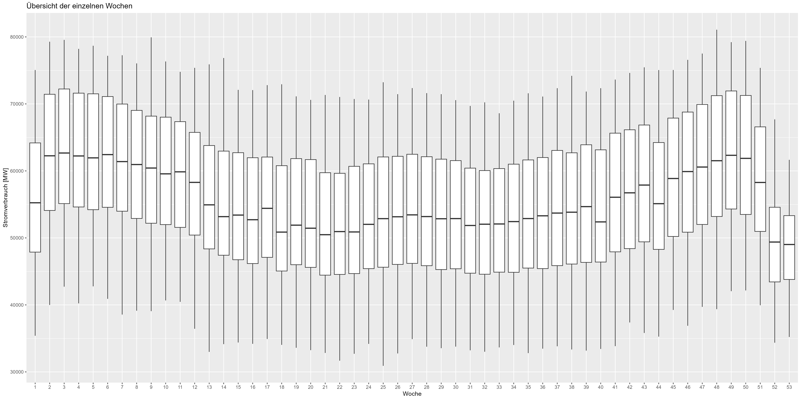
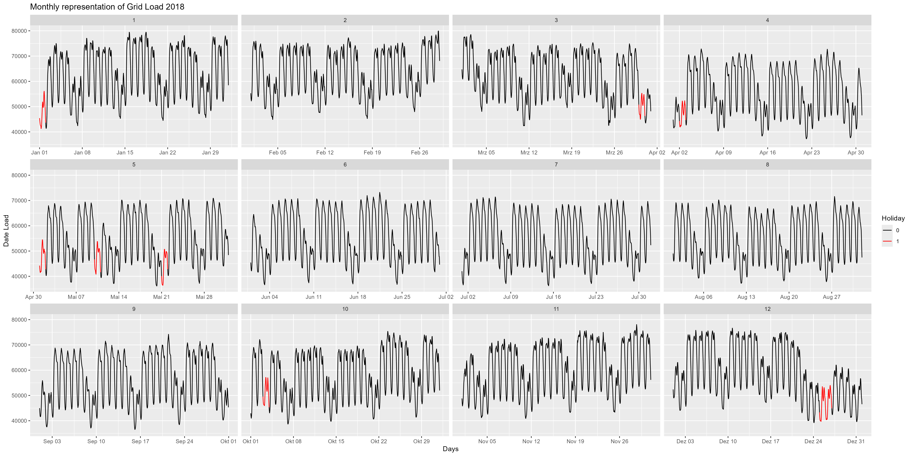

# smard-power-forecasting

This repository is for forecasting german energy power consumption.

Based on:

- [Forecasting: Principles and Practice](https://otexts.com/fpp3/)
- DOI: [10.1109/TPWRS.2011.2162082](https://ieeexplore.ieee.org/document/5985500) - Short-Term Load Forecasting Based on a Semi-Parametric Additive Model
- DOI: [10.1109/TPWRS.2009.2036017](https://ieeexplore.ieee.org/document/5345698) - Density Forecasting for Long-Term Peak Electricity Demand
- DOI: [10.1080/00031305.2017.1380080](https://www.tandfonline.com/doi/full/10.1080/00031305.2017.1380080) - Forecasting at Scale

Data source: [SMARD](https://www.smard.de/home/downloadcenter/download-marktdaten/)
    
- Resolution: 1h
- Timewindow: from 2015-01-01 to 2024-09-07

Put all dowloaded files into:

    /example/dataset

Check the [forecast.Rmd](example/forecast.Rmd) file to see how you can run
this code on your dataset.

# Database

## Raw Dataset

In this study there is a dataset for Power-Consum in germany from [SMARD](https://www.smard.de/home/downloadcenter/download-marktdaten/) for
the year 2015 - 2024.

Figure 1 shows the raw dataset with missing values (red), duplicated timestamps (orange) and
Power-Consum over time (black), hourly resolution. With one missing values and one duplicate every year it was
easy to clean up the dataset. Overall an almost clean set. After cleaning up the dataset there are
plausible observations for the Power-Consum:

- 8760 Observations for a regular year (24*365)
- 8784 Observations for a leap year (24*366)
- Remainded 4559 observations for the last year (2024), year is not complet

Figure 1 Raw Power-Consum

## Raw Dataset, yearly representation

Figure 2 is yearly representation of the years 2015-2024. We can notice here, that in
the beginning of the year there is an increase of Power-Consum and in the end of the year
there is a decrease (Christmas, New-year).

Figure 2 Raw Power-Consum - Years

The boxplot combination of all years we can see the pattern in more detail. Figure 3 shows this
pattern. 

Figure 3 Raw Power-Consum - Weeks

# Raw Dataset, monthly representation

Figure 4 is the monthly representation of the years 2018. Here we can observe in more detail
the end of the year. Around 24th December, there is a decrease of Power-Consum.

Figure 4 Raw Power-Consum - Monthly

## Raw Dataset, weekly representation

Figure 5 is weekly representation of the year 2018. Red marked lines are holidays. 
We can notice, that on holidays, but also on weekend (Saturday, Sunday) therese is a 
decrease of Power-Consum. 

Figure 5 Raw Power-Consum - Weekly

Figure 6 shows weekdays over years (2015-2024). To be sure, there is a decrease for weekend. 

Figure 6 Raw Power-Consum - Weeks

## Raw Dataset, daily representation

Figure 7 is the hourly representation of the years 2015-2018. We can notice here, that in 
the night (20:00-06:00) there is a lower Power-Consum. In the Day-Time there is a higher Power-Consum.
Between (13:00-20:00) there is a pattern for almost all days (see also Figure 3). In the middle
of the peak there is a decrease and an increase again. This needs to be tracked by the model correctly.

Figure 7 Raw Power-Consum - Hourly

# Holidays

Figure 8 shows the holiday effect. "Durchschnitt" is the mean Power-Consum over
years. There is a significant increase of Power-Consum for "Working-Days" (black) compared with holidays.

Figure 8 Holiday Effect

## Features

Within the exploration there were found few features, that are influencing Power-Consum:

- Holidays effect
- Day of the Week 
- Mean Power-Consum of last week
- Mean Power-Consum of last two days
- Max Power-Consum of last day
- Min Power-Consum of last day

## Comlex seasonality

There is a complex seasonality. For the hourly resolution there is a yearly, weekly and a daily 
seasonality. Which needs to be tracked by the model. 

## Transformation, Train and Test Dataset

Before we start with modeling we need to check ACF, PACF and also the STL-Decomposition.
Probably there is a need of transformation for the Power-Consum (Box-Cox, Log). 
This will be also involved to fit the best model.

## Model

To compare the best model there are few simple approaches, like the MEAN, NAIVE and DRIFT methods.
To compare the models we use metrics MAE and MAPE. 

### ARIMA-Automated

First approach is to use the best ARIMA Model:

    ARIMA_A=ARIMA(PowerConsum ~ 
                    WorkDay 
                  + MeanLastWeek
                  + MeanLastTwoDays
                  + MaxLastOneDay
                  + MinLastOneDay
                  , stepwise = TRUE, approx = TRUE, greedy=TRUE),

### ARIMA-Fourier

Next approach is to use the fourier terms to describe the complex seasonality. This model will select
the best PDQ and pdq parameters automatically, by defining D=0 and d=0.

    ARIMA = ARIMA(PowerConsum ~
            PDQ(D=0)
          + pdq(d=0)
          + WorkDay
          + MeanLastWeek
          + MeanLastTwoDays
          + MaxLastOneDay
          + MinLastOneDay
          + fourier(period = "day", K = 12)
          + fourier(period = "week", K = 5)
          + fourier(period = "year", K = 2),
          order_constraint = p+q <=12 & P+Q <=12
          ),

### PROPHET

The last approach is to use the Prophet Model.

    PROPHET = prophet(
      PowerConsum ~ 
        MeanLastWeek
      + MeanLastTwoDays
      + MaxLastOneDay
      + MinLastOneDay
      + WorkDay 
      + season(period = 24, order = 10) 
      + season(period = 7*24, order = 5) 
      + season(period = 365*24, order = 10)

## Results

